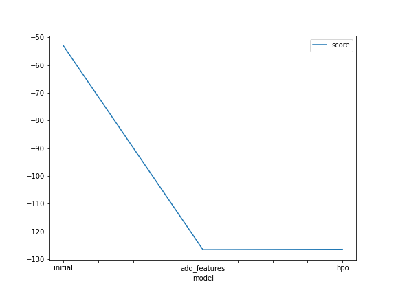

# Report: Predict Bike Sharing Demand with AutoGluon Solution
#### Zaafir Rizwan

## Initial Training
### What did you realize when you tried to submit your predictions? What changes were needed to the output of the predictor to submit your results?
Kaggle was not installed. Kaggle accepts only positve values. Output of predictors were check for negative values and were set to 0 where less than 0.

### What was the top ranked model that performed?
For model with tweaked hyperparameters, WeightedEnsemble_L3 had maximum val_score and NeuralNetFastAI_BAG_L1 had minimum val_score.

## Exploratory data analysis and feature creation
### What did the exploratory analysis find and how did you add additional features?
With exploratory data analysis we fount datetime column can be divided into day, month, year column as finding patterns becomes easy for the model.

### How much better did your model preform after adding additional features and why do you think that is?
On same hyperparameters, the score of model increased from 1.77730 to 1.80109 after feature engineering.

## Hyper parameter tuning
### How much better did your model preform after trying different hyper parameters?
Score of model decreased from 1.80109 to 1.72344 when hyperparmeters values were changed

### If you were given more time with this dataset, where do you think you would spend more time?
I would send more time on hyperparameter tuning.

### Create a table with the models you ran, the hyperparameters modified, and the kaggle score.
|model|hpo1|hpo2|hpo3|score|
|--|--|--|--|--|
|initial|1|8|20|1.77730|
|add_features|1|8|20|1.80109|
|hpo|1|4|10|1.72344|

### Create a line plot showing the top model score for the three (or more) training runs during the project.

### Create a line plot showing the top kaggle score for the three (or more) prediction submissions during the project.

## Summary
Garbage in garbage out. In order for model to perform best, we need to do EDA. In case of AutoGluon, we dont need to focus of what model should we use but our main focus should be on selecting right hyperparameter values.

